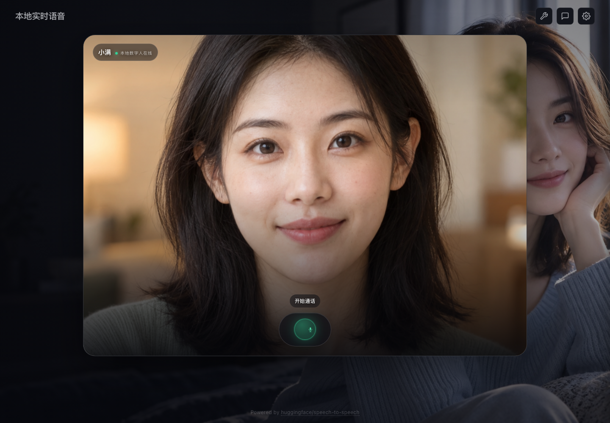
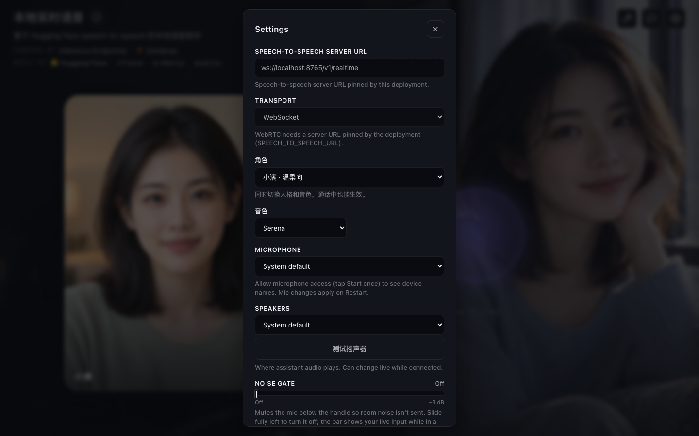
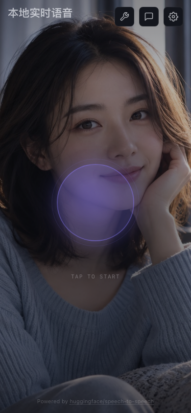

# 本地赛博 AI 女友

这是基于 Hugging Face [`speech-to-speech`](https://github.com/huggingface/speech-to-speech) 1.0.0 的本地实时语音项目，也是对[零度博客原教程](https://www.freedidi.com/24928.html)的 Apple Silicon 升级版。

它不是文字聊天套壳。浏览器持续采集麦克风，后端完成语音检测、中文识别、大模型回复和语音合成；本机数字人服务维持持续活动的角色画面，并把回复语音分块转成口型。用户直接说话，角色以带声音的动态人像回应。

## 界面预览



<table>
  <tr>
    <td width="68%"></td>
    <td width="32%"></td>
  </tr>
  <tr>
    <td align="center">模型与音频设置</td>
    <td align="center">移动端页面</td>
  </tr>
</table>

左侧是当前角色的数字人画面，右侧光球会随会话状态变化。点击光球开始通话，浏览器取得麦克风权限后即可直接说话。

```text
浏览器麦克风
    ↓ 24 kHz PCM
Silero VAD + Smart Turn
    ↓
Whisper large-v3-turbo MLX
    ↓
Qwen3 8B GGUF + llama.cpp Metal
    ↓
Qwen3-TTS MLX
    ↓
约 1 秒一段的回复音频
    ↓
MuseTalk 1.5 MLX 下半脸口型
    ↓
连续播放的口型片段

角色照片 ── LivePortrait MLX ── 持续循环的眨眼、视线与轻微呼吸
```

页面不会在每轮回复后退回静态照片。无语音时，静音待机视频持续播放眨眼和视线动作；收到 TTS 音频后，浏览器每累计约 1 秒就立即提交一个口型片段，上一段播放时后台继续生成下一段。MuseTalk 只替换下半脸，避免为了放大嘴型而带动整张脸抖动。某一段生成失败时，浏览器会播放该段原始语音，不会丢失回复。

在本仓库的 M3 Max 验证机上，预热后 1 秒音频生成 25 帧口型约需 1.02 秒。为兼顾速度和流畅度，MuseTalk 每秒计算 8 个神经口型关键帧，再插值到 25fps；启动脚本会预先编译这一常用形状。

## 当前支持范围

这套开箱脚本目前只支持 Apple Silicon Mac：

- macOS，处理器架构为 `arm64`
- 已在 M3 Max、128GB 统一内存上完成端到端验证
- 默认模型是 Qwen3-8B Q4，语音与数字人还会下载各自模型，建议至少预留 30GB 磁盘空间
- 建议使用 Chrome 或 Edge，Safari 也可以运行，但音频设备切换能力较少

本仓库的自动脚本没有适配 Intel Mac、Windows、Linux 或 NVIDIA CUDA。当前部署范围仅限 Apple Silicon Mac。

> 请使用 `./scripts/up.sh` 启动完整服务。单独执行 `docker compose up` 只会启动浏览器界面，不会启动本机模型。

## 一、安装系统依赖

### 1. 确认机器架构

打开终端：

```bash
uname -s
uname -m
```

预期输出分别是 `Darwin` 和 `arm64`。

### 2. 安装 Homebrew

如果 `brew --version` 没有输出版本号，先按照 [Homebrew 官网](https://brew.sh/)安装 Homebrew。Homebrew 提示缺少 Command Line Tools 时，执行：

```bash
xcode-select --install
```

### 3. 安装 uv、llama.cpp 和 ffmpeg

```bash
brew update
brew install uv llama.cpp
brew install ffmpeg
```

`ffmpeg` 用于数字人视频的音视频合成，也可用于制作声音克隆参考音频。项目用 `uv` 创建 Python 3.12 环境，缺少 Python 3.12 时，uv 会自动下载。安装方法可参考 [uv 官方文档](https://docs.astral.sh/uv/getting-started/installation/)和 [llama.cpp 官方仓库](https://github.com/ggml-org/llama.cpp)。

检查命令是否可用：

```bash
uv --version
llama-server --version
ffmpeg -version
```

如果新版 llama.cpp 只安装了统一的 `llama` 命令，没有 `llama-server`，请改用 Homebrew 的 `llama.cpp` 包。本项目启动脚本当前调用 `llama-server`。

### 4. 安装并启动 Docker Desktop

下载适用于 Apple Silicon 的 [Docker Desktop for Mac](https://docs.docker.com/desktop/setup/install/mac-install/)，完成安装后启动 Docker Desktop。等菜单栏图标显示 Docker 已运行，再检查：

```bash
docker version
docker compose version
```

只安装 Docker 命令行工具不够，Docker Desktop 后台服务也必须运行。

## 二、取得项目代码

首次安装时克隆项目并进入目录：

```bash
git clone https://github.com/qinsg/ai-girlfriend.git
cd ai-girlfriend
```

如果通过 ZIP 下载源码，需要恢复脚本的执行权限：

```bash
chmod +x scripts/*.sh
```

如果本机已经克隆过本仓库，先停止旧服务再更新：

```bash
./scripts/down.sh
git pull --ff-only origin main
./scripts/up.sh
```

`./scripts/up.sh` 会补装新版本增加的数字人运行时和模型。它不会删除原来的 `.env`、模型缓存或声音素材。

## 三、初始化本地环境

在项目根目录执行：

```bash
./scripts/bootstrap-macos.sh
```

脚本会完成这些工作：

1. 检查当前系统是不是 Apple Silicon Mac。
2. 检查 `uv`、`llama-server` 和 `docker`。
3. 从 `.env.example` 创建本机 `.env`。
4. 生成一个仅供本机 llama.cpp 使用的随机 API 密钥。
5. 创建 `.venv` 并按 `uv.lock` 安装 Python 依赖。
6. 下载 NLTK 的必要数据。
7. 创建 `.cache/`、`logs/` 和 `voices/` 运行目录。

数字人使用独立的 Python 环境和模型。无需提前手动安装；第一次执行 `./scripts/up.sh` 时会自动运行 `./scripts/bootstrap-avatar-macos.sh`。

`.env` 包含本机密钥，已经被 `.gitignore` 排除。不要把它提交到 GitHub。

初始化完成后可查看配置：

```bash
sed -n '1,200p' .env
```

## 四、启动完整语音服务

```bash
./scripts/up.sh
```

第一次启动会自动下载以下模型：

- Qwen3-8B GGUF Q4，用于对话回复
- `mlx-community/whisper-large-v3-turbo`，用于中文语音识别
- Qwen3-TTS 1.7B MLX 6bit，用于语音合成
- Silero VAD 和 Smart Turn，用于语音起止与轮次判断
- FasterLivePortrait-MLX 权重，用于生成持续眨眼和视线动作的待机画面
- MuseTalk 1.5 MLX 权重，用于按语音分块生成下半脸口型

模型下载和首次预热需要一些时间。终端最后出现下面的地址才算启动完成：

```text
实时语音已启动：http://localhost:7860
```

打开 [http://localhost:7860](http://localhost:7860)，点击中央圆球，允许浏览器访问麦克风，然后直接说中文。

启动完成后，本机运行以下服务：

| 服务 | 运行位置 | 默认地址 |
|---|---|---|
| 浏览器界面 | Docker Compose | `http://127.0.0.1:7860` |
| llama.cpp | macOS 宿主机 | `http://127.0.0.1:8080` |
| speech-to-speech Realtime | macOS 宿主机 | `ws://127.0.0.1:8765/v1/realtime` |
| 持续数字人 | macOS 宿主机 | `http://127.0.0.1:9871` |

不要关闭 Docker Desktop。三个宿主机服务以后台进程运行，日志写入 `logs/`。默认地址都只监听本机，不会直接暴露到局域网。

## 五、验证部署

运行一键检查：

```bash
./scripts/doctor.sh
```

正常情况下应看到：

```text
[ok] docker
[ok] uv
[ok] llama-server
[ok] curl
[ok] 官方 speech-to-speech
[ok] FasterLivePortrait-MLX
[ok] MuseTalk 1.5 MLX
[ok] llama.cpp
[ok] Realtime voice
[ok] Continuous avatar
```

也可以逐项检查：

```bash
docker compose ps
curl http://127.0.0.1:8080/health
curl http://127.0.0.1:8765/v1/usage
curl http://127.0.0.1:9871/health
```

`docker compose ps` 中的 `demo` 应为 `Up`，三个 `curl` 命令都应返回 JSON。

一次完整对话应经历这些状态：

```text
监听 → 用户说话 → 处理 → AI 说话 → 监听
```

打开右上角 Conversation 可以查看双方的实时转写。AI 播放语音时再次开口，可以测试打断功能。

## 六、停止和重新启动

停止全部服务：

```bash
./scripts/down.sh
```

重新启动：

```bash
./scripts/up.sh
```

只查看运行状态：

```bash
./scripts/doctor.sh
docker compose ps
```

修改模型、端口或 TTS 模式后，先执行 `./scripts/down.sh`，再执行 `./scripts/up.sh`。

## 七、配置说明

本机配置保存在 `.env`。常用变量如下：

| 变量 | 默认值 | 用途 |
|---|---|---|
| `DEMO_PORT` | `7860` | 浏览器界面端口 |
| `REALTIME_PORT` | `8765` | Realtime WebSocket 端口 |
| `LLM_HF_MODEL` | `Qwen/Qwen3-8B-GGUF:Q4_K_M` | llama.cpp 自动下载的 GGUF |
| `LLM_ALIAS` | `girlfriend-main` | speech-to-speech 调用的模型名 |
| `LLM_CONTEXT` | `8192` | LLM 上下文长度 |
| `LLM_API_KEY` | 自动生成 | 本机 llama.cpp API 密钥 |
| `STT_MODEL` | `mlx-community/whisper-large-v3-turbo` | MLX Whisper 模型 |
| `STT_LANGUAGE` | `zh` | 识别语言 |
| `TTS_MODE` | `custom` | `custom` 内置音色或 `clone` 声音克隆 |
| `TTS_QUANTIZATION` | `6bit` | Qwen3-TTS MLX 量化级别 |
| `TTS_SPEAKER` | `Serena` | 默认内置音色 |
| `CHARACTER_FILE` | `./config/characters.custom.json` | 浏览器角色配置 |
| `STARTUP_GREETING` | 中文提示词 | 连接成功后的主动问候 |
| `AVATAR_ENABLED` | `true` | 是否启用本地音频驱动数字人 |
| `AVATAR_PORT` | `9871` | 宿主机数字人服务端口 |
| `AVATAR_MLX_PROFILE` | `quality` | 生成待机循环时使用的 LivePortrait MLX 配置 |

### 切换到 14B LLM

默认 8B 更适合实时语音。如果机器内存足够，且更看重回复质量，可以修改 `.env`：

```dotenv
LLM_HF_MODEL=Qwen/Qwen3-14B-GGUF:Q4_K_M
```

然后重启：

```bash
./scripts/down.sh
./scripts/up.sh
```

首次切换会下载新的 GGUF。8B 模型不会被项目脚本自动删除。

### 修改角色

默认角色在 [`config/characters.custom.json`](./config/characters.custom.json)。仓库内置 `xiaoman` 和 `xiaoxue` 两个数字人角色。切换角色时，网页会同时更新照片、音色和提示词。

每个网页角色包含以下字段：

```json
{
  "角色标识": {
    "label": "设置面板中显示的名称",
    "avatar": "assets/avatars/角色照片.png",
    "voice": "Serena",
    "instructions": "角色设定和回复约束"
  }
}
```

只修改现有角色的音色或提示词时，保存 JSON 后重新构建 Demo：

```bash
docker compose up -d --build demo
```

新增角色不能只改 JSON。数字人服务还需要知道宿主机上的原始照片路径：

1. 把正面、闭嘴、无遮挡、光线均匀的成年人物半身照放入 `demo/assets/avatars/`。
2. 在 `config/characters.custom.json` 中增加角色配置。
3. 在 `avatar/service.py` 的 `PORTRAITS` 中登记同一个角色标识和照片路径。
4. 执行 `./scripts/down.sh` 和 `./scripts/up.sh`，让服务生成该角色的待机缓存。

嘴部、下巴和脸部轮廓必须清楚。图片不合适时，LivePortrait 可能检测不到脸，MuseTalk 也容易在嘴部边缘留下接缝。

如果只需要语音，不需要数字人，可在 `.env` 中设置：

```dotenv
AVATAR_ENABLED=false
```

然后执行 `./scripts/down.sh && ./scripts/up.sh`。页面会保留静态角色照片，AI 回复恢复为直接播放语音。

## 八、声音克隆

只使用本人录制或已经获得明确授权的声音。

准备一段 5 到 10 秒、背景安静、只有一个人说话的音频，然后转换为单声道 24kHz WAV：

```bash
mkdir -p voices/xiaoman
ffmpeg -i source.wav -ss 00:00:00 -t 8 -ac 1 -ar 24000 voices/xiaoman/reference.wav
```

修改 `.env`：

```dotenv
TTS_MODE=clone
CHARACTER_FILE=./config/characters.clone.json
TTS_REFERENCE_AUDIO=voices/xiaoman/reference.wav
TTS_REFERENCE_TEXT=参考音频中逐字对应的文本
```

然后重启：

```bash
./scripts/down.sh
./scripts/up.sh
```

克隆模式会改用 Qwen3-TTS Base 模型，因此第一次启动需要下载另一套 TTS 权重。参考音频位于 `voices/`，默认不会提交到 GitHub。

## 九、日志和排错

### 查看日志

```bash
docker compose logs -f demo
tail -f logs/llama.log
tail -f logs/speech.log
tail -f logs/avatar.log
```

按 `Ctrl+C` 只会退出日志查看，不会停止后台服务。

### 页面打不开

先检查 Docker Desktop 和容器：

```bash
docker version
docker compose ps
docker compose logs --tail 100 demo
```

如果 `7860` 端口被占用，修改 `.env` 中的 `DEMO_PORT`，例如：

```dotenv
DEMO_PORT=7861
```

重启后访问 `http://localhost:7861`。

### 卡在模型下载

查看两个宿主机日志：

```bash
tail -f logs/llama.log
tail -f logs/speech.log
```

`scripts/start-voice.sh` 已强制 MLX 模型使用 Hugging Face 官方 HTTPS，并关闭 Xet 下载，以避开部分镜像的大文件重定向问题。网络中断后重新执行 `./scripts/up.sh` 即可继续使用缓存。

### 有文字但没有声音

1. 打开右上角 Settings。
2. 点击“测试扬声器”。
3. 测试音也听不到时，在 Speakers 中选择实际使用的设备，例如 `MacBook Pro Speakers (Built-in)` 或已连接的 AirPods。
4. 不要选择没有扬声器的 HDMI 显示器、Teams 或 WeMeet 虚拟设备。
5. 刷新页面并重新开始对话。

新版前端会检查 Web Audio 是否被浏览器挂起。浏览器仍阻止播放时，页面会提示再次点击中央圆球启用声音。

### 只有静态照片，没有持续待机画面或口型

先检查数字人服务：

```bash
curl http://127.0.0.1:9871/health
tail -n 200 logs/avatar.log
```

健康接口应包含 `"status":"ready"`。若提示缺少运行时或权重，重新执行：

```bash
./scripts/bootstrap-avatar-macos.sh
./scripts/down.sh
./scripts/up.sh
```

健康信息应包含 `"idleVideo":true` 和 `"streamingChunks":true`。首次启动需要生成待机循环并缓存角色全部帧，完成后页面应始终显示活动画面。开始回复时短暂显示“正在准备第一段口型”是正常现象；某个口型片段生成失败时，浏览器只对该段退回纯语音。

### 能听见开场白，但说话没有反应

1. 强制刷新页面，确保加载的是 `audio-24k-v5` 前端。
2. 在 Settings 的 Microphone 中选择 `MacBook Pro Microphone (Built-in)`。
3. 把 Noise gate 拉到最左侧 `Off`。
4. 确认麦克风按钮没有显示静音状态。
5. 在 macOS“系统设置 → 隐私与安全性 → 麦克风”中允许当前浏览器访问麦克风。
6. 结束旧对话并重新开始。

当前版本会自动优先使用内建麦克风，并通过静音输出连接保持采集 Worklet 持续运行。

### llama.cpp 启动失败

```bash
tail -n 200 logs/llama.log
llama-server --version
```

Homebrew 升级后若命令路径发生变化，先执行：

```bash
brew reinstall llama.cpp
```

### 清理残留进程

正常情况使用：

```bash
./scripts/down.sh
```

脚本只会停止 PID 文件中且命令行与 `llama-server`、`speech-to-speech` 或本项目数字人服务匹配的进程，不会按名称误杀其他程序。

如果服务仍占用端口，但 `logs/*.pid` 已丢失，先找出监听进程：

```bash
lsof -nP -iTCP:8080 -iTCP:8765 -iTCP:9871 -sTCP:LISTEN
```

逐个核对命令行，确认属于本项目后再停止：

```bash
ps -p <PID> -o pid=,command=
kill <PID>
```

不要使用 `killall python` 或 `pkill -f uvicorn`，这些命令可能停止其他项目。

## 项目目录

```text
.
├── config/                     # 角色和音色配置
├── avatar/                     # 本地音频驱动数字人适配服务
├── demo/                       # Realtime 浏览器客户端、角色照片与首页背景图
├── docs/screenshots/           # README 使用的界面截图
├── scripts/                    # 初始化、启动、停止和诊断脚本
├── src/speech_to_speech/       # 官方语音管线
├── voices/                     # 本机声音克隆素材，不提交音频
├── docker-compose.yml          # 浏览器 Demo 容器
├── .env.example                # 可提交的配置模板
├── pyproject.toml              # Python 项目与依赖
└── uv.lock                     # Python 依赖锁文件
```

Hugging Face 上游原始说明保存在 [`UPSTREAM.md`](./UPSTREAM.md)。数字人运行时版本、权重位置和上游项目见 [`avatar/README.md`](./avatar/README.md)。

## 许可证

项目主体来自 Hugging Face `speech-to-speech`，使用 Apache-2.0 许可证。数字人使用 FasterLivePortrait-MLX、LivePortrait 和 MuseTalk 1.5 的本地运行组件，使用前请同时查看其上游许可证和模型说明。发布修改版本时请保留 [`LICENSE`](./LICENSE) 和上游版权信息。
